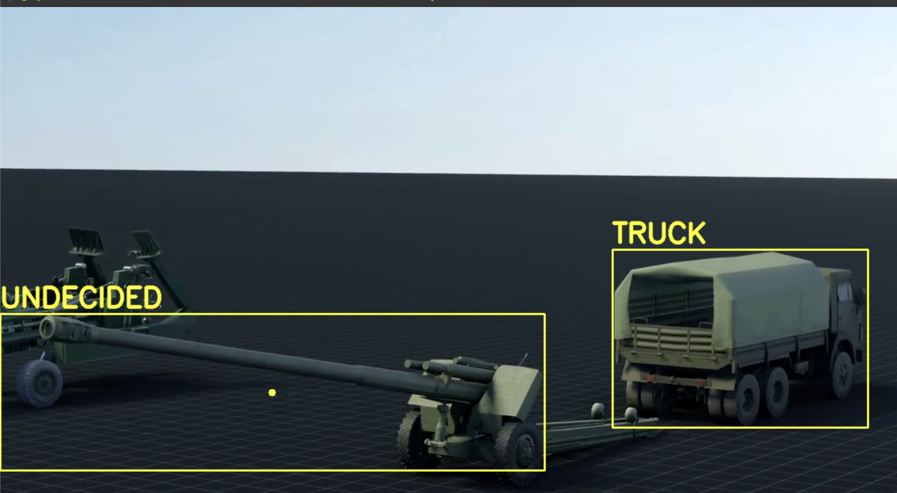

# Howitzer detection/decoy recognition (YOLOv8)


## Idea

The use of artillery units decoys became absolutely normal for warfare in the 21st century, in which precision long-range weapons are widely used. Usage of howitzer decoys allows to reduce losses of this extremely expensive type of weapon. 

However, if you are a FPV-drone-kamikaze operator and you are faced with the task of recognizing whether the target you discovered is real or just a decoy, you must know a clear algorithm for how to distinguish between them so as not to waste your weapon and cause real damage to the enemy.And since the quality of the image transmitted through the camera of an FPV drone is not always high and it can be difficult to visually distinguish between a mock-up and a real weapon, you have to pay attention to other signs, such as the presence of personnel or vehicles around the weapon that transport ammunition: trucks, tactical autos and minibuses.

However, the point of developing military technology is to make the task as simple as possible for soldiers, so this program was developed to detect artillery untis and classify them into decoys and real ones.

## Programm 
The program consists of three neural network models. The first is a YOLOv8 model, trained on a custom dataset (with more than 2000 images) to find artillery units (regardless of whether it is a decoy or not) from any video. The second is the YOLOv8l model with default settings, which is focused on searching for cars, people and other transport equipment around a detected object.

This way programm creates area around detected howitzers, where could be found such objects as humans (obviousle soldiers) and vehicles:

 ```bash
    new_x1 = max(0, x1 - (x2 - x1) // 0.5)
    new_y1 = max(0, y1 - (y2 - y1) // 0.5)
    
    new_x2 = min(frame.shape[1], x2 + (x2 - x1) // 0.5)
    new_y2 = min(frame.shape[0], y2 + (y2 - y1) // 0.5)

    cropped_frames = frame[int(new_y1):int(new_y2), int(new_x1):int(new_x2)]
 ```
    
Programm also contains my own analyzer ANN-model, made with Tensorflow and Keras, which will analyze detected objects and make a decision is there a real howitzer or decoy. Obviously, in some cases it will mark targets as undecided objects and ask operators for help, but in general, it may make frone operators job much more easy.

This way you should upload analyzer model with pickle:

```bash
    import pickle
    file_path = "path/to/pickle/file"

    with open(file_path, 'rb') as file:
        analyzer_model = pickle.load(file)
 ```


## Installations

Before running programm, don't forget to install all necessary packages:
```bash
   pip install opencv-python
   pip install ultralytics
   pip install tensorflow
   pip install scikit-learn
   pip install numpy
   pip install pandas 
   pip install seaborn 
 ```

They are necessary for running all of three models.
## Example


This way programm returns detection of real targets:


--------------------------------
This way programm returns detection of 
undecided targets:


--------------------------------

This way programm returns detection of 
decoys:


The possible functionality of project is to be combined with FPV-drones to implement CV technologies into military targets recognition. Of course it is also possible to make such programm recognize and classify different types of weapons: vehicles, MANPADS and etc. 

Thanks for attantion, hope you will find it useful:)

## Authors:
- Kucher Maks (maxim.kucher2005@gmail.com)


